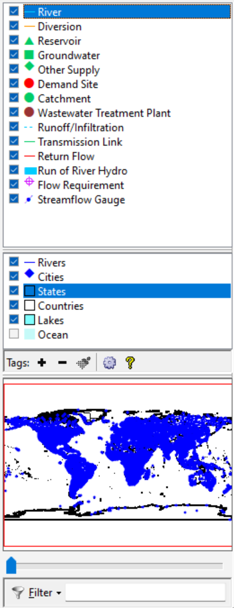
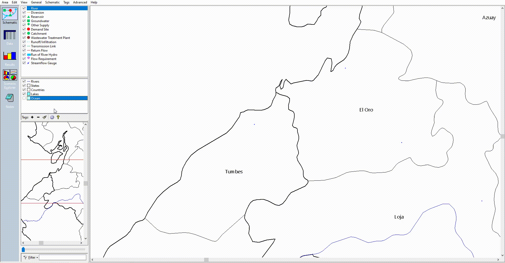

# ESQUEMÁTICA
La Vista Esquemática sirve como punto de partida para todas las actividades en WEAP. A continuación, se presentan los elementos que la componen junto con las funcionalidades que cada uno ofrece:

*	Leyenda de WEAP

<table style="width: 100%; border: 0px; border-collapse: collapse; text-align:justify;">
  <tr>
    <td style="width: 50%; border: 0px;">
      
    </td>
    <td style="width: 50%; border: 0px;">
      La Vista Esquemática es el punto de partida para todas las actividades en WEAP. Una característica central de WEAP es su interfaz gráfica de "arrastrar y soltar" fácil de usar, que se emplea para describir y visualizar las características físicas del sistema de oferta y demanda de agua. Este diseño espacial se denomina esquema. Puede crearlo, editarlo y visualizarlo en la Vista Esquemática. Se pueden agregar capas SIG para brindar mayor claridad e impacto.
    </td>
  </tr>
</table>

    

 

* Gestor de Capas SIG en WEAP

El gestor de capas SIG en WEAP es una herramienta fundamental para <b>visualizar</b>, datos geográficos dentro del contexto de la herramienta. Su principal función reside en la superposición de información espacial sobre el esquema WEAP, permitiendo al usuario representar gráficamente elementos geográficos como ríos, cuencas hidrográficas, límites políticos, infraestructura hidráulica y otros datos relevantes para el análisis del sistema hídrico. Esto facilita la comprensión espacial del modelo y la identificación de patrones o relaciones entre los componentes del sistema.

Este gestor presenta las siguientes funcionalidades:

<table style="width: 100%; border: 0px; border-collapse: collapse; text-align:justify;">
  <tr>
    <td style="width: 30%; border: 0px;">
      Casilla de verificación  
Esta función permite que cada capa se pueda ocultar o mostrar en el esquema. También permite ocultar o mostrar todos los mapas a la vez, haciendo clic derecho en la lista de capas de fondo y seleccionando "Ocultar o Mostrar todas las capas.
</td>
    <td style="width: 70%; border: 0px;">
      
    </td>
  </tr>
</table>

* test

    
    <a href="#" class="cerrar-popup">Cerrar</a>

